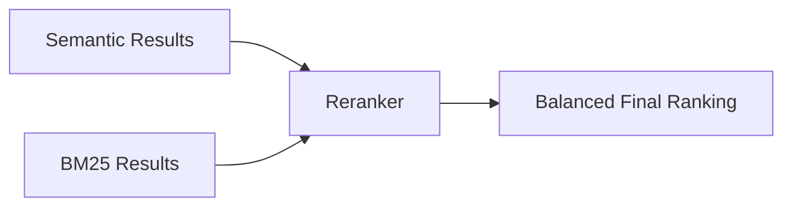
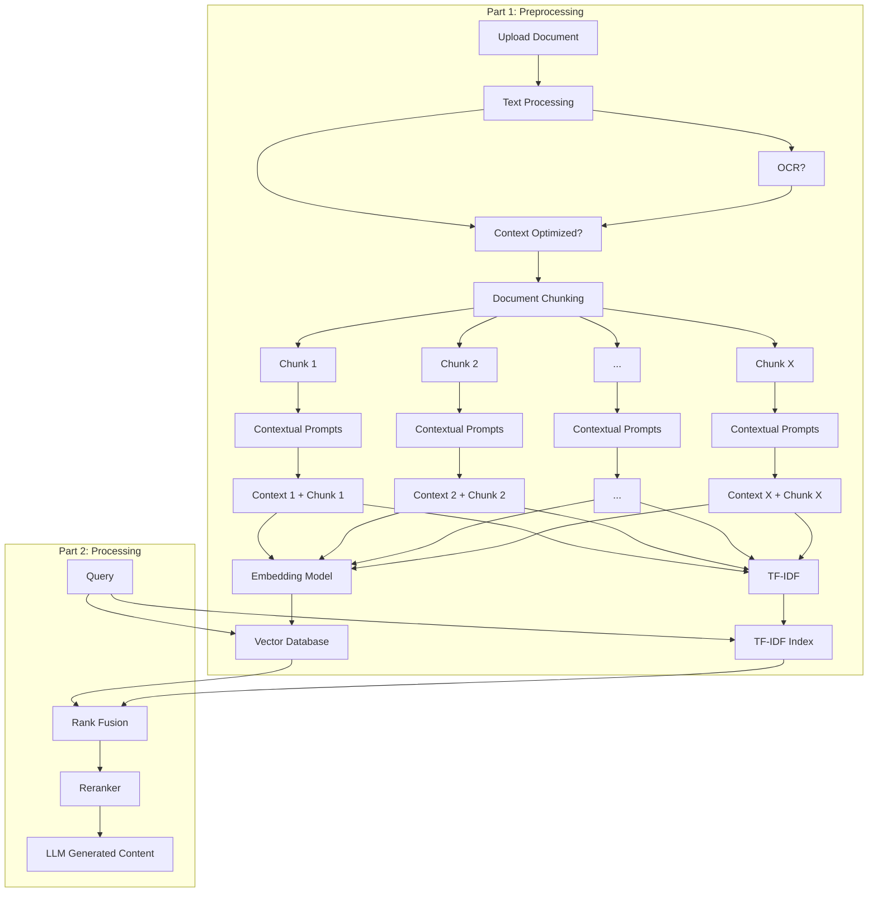

#  Advanced RAG Pipeline with Contextual Embeddings

---

##  Introduction

This project builds an **advanced RAG (Retrieval-Augmented Generation) pipeline** that implements **contextual embeddings**—a technique that enhances document chunks by adding contextual descriptions to improve retrieval accuracy.

---

## Traditional RAG Limitations

Traditional RAG systems typically use semantic embeddings with text splitters (such as `recursive character text splitters`) to break documents into chunks. While these approaches excel at finding semantically similar content, they often fail to preserve important contextual relationships between chunks.

### Core Problem

```
Document → Chunks → Embeddings → Retrieval
    ↓
 Context Loss: Isolated chunks lose surrounding information
 Poor Relationships: No understanding of chunk dependencies  
 Reduced Accuracy: Missing contextual clues affect relevance
```

---

##  Contextual Embeddings Solution

Using a **Large Language Model (LLM)** to generate contextual descriptions for each chunk.

### Context Integration Process

These descriptions incorporate information from:

```
<document> 
{{WHOLE_DOCUMENT}} 
</document> 
Here is the chunk we want to situate within the whole document 
<chunk> 
{{CHUNK_CONTENT}} 
</chunk> 
Please give a short succinct context to situate this chunk within the overall document for the purposes of improving search retrieval of the chunk. Answer only with the succinct context and nothing else. 
```

### Benefits

```diff
+ Maintains semantic relationships across chunks
+ Provides richer contextual representations  
+ Improves retrieval relevance and accuracy
+ Reduces information fragmentation
```

---

## BM25 Integration

**BM25** is a probabilistic ranking function based on **TF-IDF** _(Term Frequency-Inverse Document Frequency)_ principles.

### Why BM25?

| Search Type         | Strength                 | Weakness                    |
| ------------------- | ------------------------ | --------------------------- |
| **Semantic Search** | Conceptual similarity    | Exact match struggles       |
| **BM25**            | Precise keyword matching | Poor semantic understanding |

### BM25 Excels At:

-  **Names and proper nouns**
-  **Phone numbers and addresses**
-  **Product codes and technical terms**
-  **Exact phrases and terminology**

> **Result**: A hybrid system that handles both conceptual queries and precise factual lookups.

---

##  Reranking Strategy

Since our pipeline employs a **hybrid approach** combining semantic similarity search with exact keyword matching, a sophisticated reranking system is essential.

### Reranker Functions:



- **Balances** results from both semantic and keyword-based retrieval
- **Prevents bias** toward either approach
- **Optimizes ranking** based on query type and context
- **Ensures relevance** regardless of retrieval method


##  Pipeline Architecture



